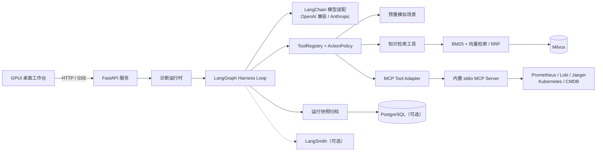
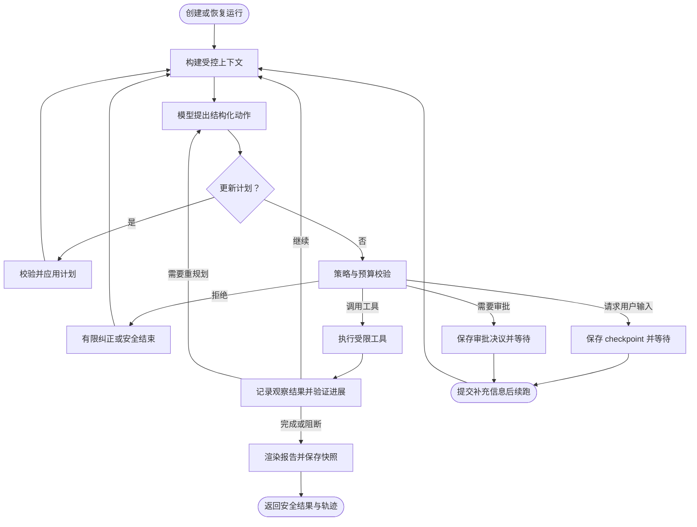

# OpsMind

OpsMind 是一个用于运维故障诊断的受控 Agent Harness。它把大语言模型限制在「提出下一步结构化动作」这一职责内，由 Harness 统一完成计划、上下文构建、策略校验、工具执行、证据判断、重规划、审批、归档和回放。

项目提供 FastAPI 后端和 GPUI 桌面工作台。它可以结合预置的可复现场景、Markdown 知识库、Milvus 混合检索，以及通过 MCP 接入的 Prometheus、Loki、Jaeger、Kubernetes 和 CMDB，生成带证据依据的诊断报告。

> OpsMind 默认只提供受限的只读观测工具，不执行 Shell 命令，不修改外部系统，也不自动执行生产变更。

## 目录

- [核心能力](#核心能力)
- [系统架构](#系统架构)
- [Harness 运行机制](#harness-运行机制)
- [项目结构](#项目结构)
- [运行要求](#运行要求)
- [快速开始](#快速开始)
- [配置](#配置)
- [知识库与 RAG](#知识库与-rag)
- [MCP 数据连接](#mcp-数据连接)
- [桌面工作台](#桌面工作台)
- [HTTP API](#http-api)
- [运行归档与回放](#运行归档与回放)
- [评测与可观测性](#评测与可观测性)
- [质量检查](#质量检查)
- [安全边界与限制](#安全边界与限制)

## 核心能力

### 受控诊断工作流

- 使用 LangGraph 编排有状态的诊断循环，而不是让模型直接执行任意工具。
- 使用 LangChain 的聊天模型和结构化输出，将模型结果约束为 `AgentAction`。
- 维护显式计划、计划版本和重规划原因；当新证据推翻判断或流程持续无进展时，Harness 可以修订计划。
- 对每个候选动作执行工具注册、参数白名单、重复调用、单工具次数、总步骤、工具调用、模型调用、Token、运行时间和估算成本校验。
- 收集工具观察结果和知识库引用，通过证据门槛约束最终结论。
- 信息不足时暂停运行并请求用户补充信息；高风险动作先记录审批决议，再由用户显式续跑。
- 对模型和工具失败进行分类、有限重试或安全终止；全部运行状态可生成 checkpoint。

### RAG 知识库

- 从 Markdown 文档读取标题、正文和元数据，并按稳定规则分块。
- 使用 OpenAI Embeddings API 或兼容接口生成向量，写入 Milvus。
- 同时执行向量检索和 BM25 关键词检索，并通过倒数排名融合（RRF）得到混合检索结果。
- 支持新增 Markdown 知识、同步入库、检索质量评测和报告引用。

### 数据与工具接入

- 内置四个可复现的模拟故障场景，覆盖 HTTP 5xx、服务延迟、数据库连接池和 Redis 缓存问题。
- 可选直连 Prometheus 的只读即时查询。
- 内置 stdio MCP Server，可受限调用 Prometheus、Loki、Jaeger、Kubernetes 和 CMDB。
- 所有工具都经由 `ToolRegistry` 注册，并由同一套策略、预算和审计轨迹约束。

### 交互、归档与评测

- FastAPI 提供普通 HTTP 接口、SSE 实时事件流和安全的历史回放接口。
- GPUI 桌面端提供诊断、知识库、历史记录和设置页面；诊断报告可下载为 Markdown。
- 运行快照可保存在内存或 PostgreSQL；PostgreSQL 模式下服务重启后仍能读取、恢复和回放运行。
- 提供固定检索样本、端到端诊断基准、Harness 组件消融配置和可选 LangSmith Trace。

## 系统架构



| 层级 | 主要组件 | 职责 |
| --- | --- | --- |
| 桌面端 | GPUI、Rust | 输入故障描述、展示安全轨迹和报告、查看知识与历史、配置模型和数据连接。 |
| 服务层 | FastAPI、SSE | 提供诊断运行、知识库、设置、历史回放、健康检查和就绪检查接口。 |
| 运行时 | LangGraph、LangChain | 将模型动作、Harness、工具目录和归档组合为一次诊断运行。 |
| Harness | `app/harness/` | 管理计划、上下文、策略、预算、证据、进度、审批、checkpoint 和回放。 |
| 知识层 | Markdown、BM25、Milvus | 导入知识、混合检索、质量评测和报告引用。 |
| 数据连接 | MCP、Tool Adapter | 以统一且受限的工具形式读取外部观测与配置系统。 |
| 存储与追踪 | PostgreSQL、Milvus、LangSmith | 分别用于可选运行归档、向量检索和可选调用追踪。 |

## Harness 运行机制

模型不会直接执行工具。模型只返回结构化的下一步 `AgentAction`，Harness 决定该动作是否允许执行，并记录每个状态变化。



### 主要控制点

| 控制点 | 作用 |
| --- | --- |
| `PlanManager` | 维护任务计划、计划项状态、历史版本和重规划原因。 |
| `ContextManager` | 从会话、工具结果、证据和检索结果中构建受限上下文，并控制上下文长度。 |
| `ActionPolicy` | 校验工具是否注册、参数是否允许、是否重复调用、风险等级和各项预算。 |
| `BudgetManager` | 跟踪步骤、工具调用、模型调用、Token、运行时间与估算成本。默认单次运行最多 12 步、6 次工具调用、8 次模型调用、24,000 Token、120 秒和 0.1 美元估算成本。 |
| `ProgressVerifier` | 判断工具执行是否产生新证据或推进计划，识别停滞与需要重规划的情况。 |
| `EvidenceCollector` / `EvidenceGate` | 从工具结果和 RAG 引用中形成证据链，并约束报告结论。 |
| `ApprovalResolver` | 对高风险动作保存批准、编辑或拒绝决议；批准后仍需显式恢复运行。 |
| `RunArchive` | 保存可恢复快照与安全轨迹，支持历史查询、缓存回放和续跑。 |

## 项目结构

```text
OpsMind/
├── app/
│   ├── agents/          # LangChain 结构化动作提供器
│   ├── api/             # FastAPI 应用、路由、Schema、SSE 与中间件
│   ├── diagnosis/       # 模型提供器与 Harness 运行时装配
│   ├── harness/         # LangGraph Loop、策略、预算、证据、审批、归档与评测
│   ├── mcp/             # MCP 配置和内置观测 MCP Server
│   ├── models/          # Pydantic 领域契约和状态模型
│   ├── observability/   # 日志和 LangSmith 追踪
│   ├── rag/             # 文档、Embedding、BM25、RRF、Milvus 与检索评测
│   ├── scenarios/       # 预置可复现故障场景
│   └── tools/           # 工具注册表、场景工具、RAG、Prometheus 与 MCP 适配
├── data/
│   ├── knowledge/       # 初始 Markdown Runbook
│   └── evaluations/     # 检索与端到端诊断固定样本
├── docs/                # 分阶段设计与实现记录
├── frontend/
│   ├── assets/          # 桌面应用图标
│   └── src/             # GPUI 工作台、HTTP 客户端和 SSE 解析器
├── scripts/             # 知识入库、检索评测、基准运行与结果比较
├── tests/               # Python 单元、集成与 API 测试
├── docker-compose.yml   # PostgreSQL 与 Milvus 本地依赖
├── .env.example         # 本地配置模板
└── pyproject.toml       # Python 依赖、测试、Ruff 和 mypy 配置
```

## 运行要求

- Python 3.12（项目的 `requires-python` 固定为 `>=3.12,<3.13`）
- [uv](https://docs.astral.sh/uv/) 用于管理 Python 和依赖
- Docker Desktop，用于 PostgreSQL 与 Milvus
- Rust 工具链，用于编译和运行 GPUI 桌面端
- 至少一个可用的聊天模型配置，才能创建真实诊断运行

可选要求：

- OpenAI Embeddings API 或兼容服务，用于 RAG 入库和查询
- Prometheus、Loki、Jaeger、Kubernetes API、CMDB 中的任意实际只读数据源
- LangSmith API Key，用于追踪模型和 Harness 运行

## 快速开始

以下步骤启动完整的本地开发环境。所有命令均在项目根目录执行。

### 1. 安装 Python 依赖

```bash
cp .env.example .env
uv sync --all-groups
```

### 2. 启动本地基础设施

```bash
docker compose up -d
```

该命令启动 PostgreSQL、Milvus、etcd 和 MinIO。PostgreSQL 仅在启用持久化运行归档时必需；Milvus 在配置 RAG 或调用就绪检查时必需。

### 3. 配置聊天模型

在 `.env` 中选择一种模型提供器。未配置模型时，健康检查、场景目录和知识库目录仍然可用，但创建诊断运行会返回 `503`。

OpenAI Chat Completions 兼容接口示例：

```dotenv
LLM_PROVIDER=openai
LLM_MODEL=your-model-name
LLM_API_KEY=your-api-key
LLM_BASE_URL=https://your-compatible-endpoint/v1
```

Anthropic Messages 接口示例：

```dotenv
LLM_PROVIDER=anthropic
LLM_MODEL=your-model-name
ANTHROPIC_API_KEY=your-api-key
ANTHROPIC_BASE_URL=https://your-compatible-endpoint
```

提供器专用密钥优先于通用的 `LLM_API_KEY`。目前仅支持 `openai` 和 `anthropic` 两种 `LLM_PROVIDER` 值。

### 4. 启动后端

```bash
uv run uvicorn app.api.main:app --reload
```

后端默认监听 `http://127.0.0.1:8000`。可打开 `http://127.0.0.1:8000/docs` 查看 OpenAPI 文档。

### 5. 启动桌面工作台

在另一个终端执行：

```bash
cargo run --manifest-path frontend/Cargo.toml
```

桌面端默认连接 `http://127.0.0.1:8000`。先确认后端已启动，再创建诊断运行。

### 6. 检查服务状态

```bash
curl http://127.0.0.1:8000/api/v1/health
curl http://127.0.0.1:8000/api/v1/ready
```

`/health` 仅表示 FastAPI 进程存活。`/ready` 还会检查已启用的 PostgreSQL 归档和 Milvus；依赖未就绪时返回 `503`，且不会暴露连接串或原始异常。

## 配置

### 配置来源与优先级

`app.config.Settings` 从真实环境变量和项目根目录 `.env` 读取配置。桌面端的「设置」页面可以读取当前非敏感配置并保存覆盖项。

- `.env` 适合本地开发和初始配置。
- 桌面端保存的数据连接与模型设置位于 `.opsmind/mcp-configuration.json`，该目录已被 Git 忽略。
- 令牌和 API Key 不会通过 API 回显；界面只显示是否已配置。
- 保存桌面端设置后，后续新建的诊断运行立即使用新模型、Embedding 与工具目录。

### 运行归档

默认值为进程内存归档：

```dotenv
RUN_ARCHIVE_BACKEND=memory
```

内存归档在服务重启后丢失。若要将运行快照持久化到 PostgreSQL，请先启动 Docker 服务，再设置：

```dotenv
RUN_ARCHIVE_BACKEND=postgres
```

应用启动时会创建 `run_snapshots` 表。创建、等待输入、审批和续跑都会替换同一运行的最新快照。若 PostgreSQL 未启动，不要启用 `postgres`；应用会启动失败，而不会静默降级到内存归档。

### 模型设置

| 配置 | 说明 |
| --- | --- |
| `LLM_PROVIDER` | `openai` 或 `anthropic`。 |
| `LLM_MODEL` | 当前提供器的模型名称。 |
| `LLM_API_KEY` | 通用 API Key，可被提供器专用 Key 覆盖。 |
| `LLM_BASE_URL` | OpenAI 兼容或 Anthropic 兼容网关地址。 |
| `OPENAI_API_KEY` / `OPENAI_BASE_URL` | OpenAI 提供器专用配置。 |
| `ANTHROPIC_API_KEY` / `ANTHROPIC_BASE_URL` | Anthropic 提供器专用配置。 |

使用 DeepSeek OpenAI 兼容地址时，运行时会关闭 thinking 模式，并采用 function calling 结构化输出方式，以匹配当前工具调用协议。

### Embedding 设置

```dotenv
EMBEDDING_MODEL=your-embedding-model
EMBEDDING_API_KEY=your-api-key
EMBEDDING_BASE_URL=https://your-compatible-endpoint/v1
EMBEDDING_VECTOR_SIZE=1536
KNOWLEDGE_COLLECTION_NAME=opsmind_knowledge
KNOWLEDGE_SOURCE_DIRECTORY=data/knowledge
```

`EMBEDDING_VECTOR_SIZE` 必须与 Embedding 模型的实际输出维度一致。应用、入库脚本和检索评测必须使用同一组模型、维度、集合名称和知识目录配置。

## 知识库与 RAG

### 导入初始知识

仓库的 `data/knowledge/` 中包含与预置场景对应的示例 Runbook。完成 Embedding 配置并启动 Milvus 后，执行：

```bash
uv run python -m scripts.ingest_knowledge
```

脚本按文件名稳定排序读取 Markdown，并使用 Milvus upsert，因此可重复执行。也可指定其他目录：

```bash
uv run python -m scripts.ingest_knowledge --source-dir path/to/knowledge
```

### 新增和查看知识

桌面端的「知识库」页面可以查看已加载文档的标题、分块数和正文，也可以新增 Markdown 知识。新增文档会先写入 `KNOWLEDGE_SOURCE_DIRECTORY`，再同步写入 Milvus；Embedding 或 Milvus 不可用时，接口返回 `503`，并删除未成功入库的本次文件。

后端对应接口：

- `GET /api/v1/knowledge`：列出知识目录。
- `GET /api/v1/knowledge/{document_id}`：读取一篇 Markdown 正文。
- `POST /api/v1/knowledge`：新增 Markdown 并同步入库。

### 检索流程

1. 将用户查询向量化。
2. 在 Milvus 中执行向量相似度检索。
3. 在同源 Markdown 分块中执行 BM25 关键词检索。
4. 用 RRF 融合两组结果，得到排序后的知识片段和来源。
5. 将受限的检索结果作为 `query_knowledge` 工具观察结果提供给 Harness。

### 评测检索质量

```bash
uv run python -m scripts.evaluate_retrieval
```

命令输出 JSON，包括 `recall_at_k`、`mean_reciprocal_rank`、每条样本的预期来源与实际来源。指定 `--fail-on-miss` 后，任意固定样本未命中前 K 条结果时命令以状态码 `1` 退出：

```bash
uv run python -m scripts.evaluate_retrieval --top-k 3 --fail-on-miss
```

## MCP 数据连接

### 内置 MCP Server

OpsMind 内置的 stdio MCP Server 位于 `app.mcp.observability_server`。Harness 不直接拼接外部观测系统的请求，而是通过 `StdioMcpToolInvoker` 调用 MCP Server，并将结果适配为 `ToolRegistry` 工具。

启用后可使用以下只读工具：

| 工具 | 目标系统 | 允许的查询范围 |
| --- | --- | --- |
| `query_prometheus` | Prometheus | 单条 PromQL 即时查询。 |
| `query_loki` | Loki | 单条 LogQL 近期日志查询。 |
| `query_jaeger` | Jaeger | 按服务名查询调用链。 |
| `query_kubernetes` | Kubernetes API | 指定命名空间的 `pods`、`services`、`deployments` 或 `events`。 |
| `query_cmdb` | CMDB | 按服务名读取服务与依赖信息。 |

每个 MCP 工具在一次诊断中最多调用两次。工具会限制查询文本、返回条目数和上游响应体大小；Kubernetes 资源种类固定为白名单，所有请求都使用 HTTP `GET`。

### 启用 MCP

在 `.env` 中设置 MCP 启动命令和所需数据源地址：

```dotenv
OBSERVABILITY_MCP_COMMAND=uv
OBSERVABILITY_MCP_ARGS=run python -m app.mcp.observability_server

PROMETHEUS_URL=http://127.0.0.1:9090
PROMETHEUS_BEARER_TOKEN=your-read-only-token
LOKI_URL=http://127.0.0.1:3100
LOKI_BEARER_TOKEN=your-read-only-token
JAEGER_URL=http://127.0.0.1:16686
JAEGER_BEARER_TOKEN=your-read-only-token
KUBERNETES_URL=https://your-kubernetes-api.example
KUBERNETES_BEARER_TOKEN=your-read-only-token
CMDB_URL=https://your-cmdb.example
CMDB_BEARER_TOKEN=your-read-only-token
```

MCP 启用时，系统注册上述五类 MCP 工具。未启用 MCP 且已设置 `PROMETHEUS_URL` 时，系统仅注册原有的 Prometheus 直连工具。未配置地址的数据源在实际调用时会以安全错误返回，不会泄露令牌。

### 在桌面端配置

桌面端「设置」页面可以：

- 查看 MCP 是否启用、服务启动命令和各数据源的当前地址。
- 修改 Prometheus、Loki、Jaeger、Kubernetes 和 CMDB 的地址与只读令牌。
- 查看与配置 LLM、Embedding 模型、Base URL 和向量维度。
- 载入当前非敏感配置；已保存的密钥不会回显到输入框。

本机覆盖配置保存在 `.opsmind/mcp-configuration.json`，文件权限设为仅当前用户可读写。不要将该文件或 `.env` 提交到版本控制。

## 桌面工作台

GPUI 桌面端是后端的操作界面，不承载 Agent 业务逻辑。它通过 HTTP 和 SSE 调用 FastAPI。

| 页面 | 功能 |
| --- | --- |
| 诊断 | 输入故障描述、发起实时运行、查看可展开的安全轨迹、查看报告并下载 Markdown。 |
| 知识库 | 查看已加载的知识文档、正文和分块信息，新增知识文档。 |
| 历史记录 | 按快照保存时间查看已归档运行，并读取运行结果。 |
| 设置 | 查看和保存模型、Embedding、MCP 与各外部数据源配置。 |

为了避免泄露无关内部信息，桌面端不展示模型提示词、工具参数、原始工具观察结果、完整上下文、checkpoint 内容或令牌明文。轨迹只展示安全的事件摘要、步骤、动作类型、工具名称、耗时、Token 用量、决策与错误信息。

## HTTP API

所有接口使用 `/api/v1` 前缀。交互式接口文档在后端启动后可访问 `http://127.0.0.1:8000/docs`。

| 分类 | 接口 | 说明 |
| --- | --- | --- |
| 系统 | `GET /health` | 检查 FastAPI 进程是否存活。 |
| 系统 | `GET /ready` | 检查 PostgreSQL 归档和 Milvus 的就绪状态。 |
| 诊断 | `POST /runs` | 创建一次同步受控诊断运行。 |
| 诊断 | `POST /runs/stream` | 以 SSE 返回实时安全事件和最终结果。 |
| 诊断 | `GET /runs` | 获取最近 30 条运行历史。 |
| 诊断 | `GET /runs/{run_id}` | 读取一次已归档运行的安全结果。 |
| 诊断 | `POST /runs/{run_id}/input` | 提交补充信息并续跑等待用户输入的运行。 |
| 审批 | `POST /runs/{run_id}/approval` | 记录高风险动作的批准、编辑或拒绝决议。 |
| 审批 | `POST /runs/{run_id}/approval/resume` | 从已批准的 checkpoint 显式续跑。 |
| 回放 | `GET /runs/{run_id}/trajectory` | 获取缓存的安全轨迹。 |
| 回放 | `POST /runs/{run_id}/replay` | 返回安全轨迹副本，不重新执行模型或工具。 |
| 回放 | `GET /runs/{run_id}/events` | 以 SSE 回放已归档事件。 |
| 知识库 | `GET /knowledge`、`GET /knowledge/{document_id}`、`POST /knowledge` | 查看、新增知识文档。 |
| 配置 | `GET /mcp`、`PUT /mcp` | 查看和保存本机 MCP、模型与 Embedding 设置。 |
| 目录 | `GET /scenarios`、`GET /tools` | 查看可用模拟场景和受控工具策略摘要。 |

## 运行归档与回放

每次新建、等待用户输入、记录审批或续跑都会产生或替换该运行的快照。快照包含可恢复的类型化状态和完整内部轨迹；对外 API 和桌面端只返回经过投影的安全字段。

- **内存归档**：默认模式，适合快速开发；进程重启后数据不可恢复。
- **PostgreSQL 归档**：设置 `RUN_ARCHIVE_BACKEND=postgres` 后启用；可在服务重启后查询、恢复和回放运行。
- **缓存回放**：只读取保存的快照，不调用模型、工具或 LangGraph 节点，因此不会造成新的外部访问。
- **续跑**：只有处于等待用户输入或完成审批决议的 checkpoint 才能恢复；续跑会保留既有预算与轨迹，而不是创建一条无关的新运行。

## 评测与可观测性

### 端到端诊断基准

`data/evaluations/diagnosis_cases.json` 包含与预置场景对应的烟雾样本。配置聊天模型后执行：

```bash
uv run python -m scripts.run_benchmark
```

输出 JSON 包括每条样本的轨迹、根因和工具证据检查，以及完成率、轨迹通过率、平均工具调用、平均模型调用、重复工具调用率、平均 Token 与上下文长度。加上 `--fail-on-failure` 可将任一样本失败转换为状态码 `1`：

```bash
uv run python -m scripts.run_benchmark --fail-on-failure
```

完整评测集会产生更多模型调用，需显式指定：

```bash
uv run python -m scripts.run_benchmark \
  --cases-file data/evaluations/diagnosis_cases_full.json \
  --fail-on-failure
```

### Harness 组件消融

端到端基准支持三种受控配置：

- `full`：默认完整 Harness。
- `without_context_manager`：关闭 Context Manager。
- `without_progress_verifier`：关闭 Progress Verifier。

三种配置共用相同模型、样本、工具、策略、预算、证据门槛和归档实现；只关闭指定组件。分别保存结果后可比较：

```bash
mkdir -p data/runtime/benchmarks

uv run python -m scripts.run_benchmark --profile full \
  > data/runtime/benchmarks/full.json
uv run python -m scripts.run_benchmark --profile without_context_manager \
  > data/runtime/benchmarks/without_context_manager.json
uv run python -m scripts.run_benchmark --profile without_progress_verifier \
  > data/runtime/benchmarks/without_progress_verifier.json

uv run python -m scripts.compare_benchmark_results \
  data/runtime/benchmarks/full.json \
  data/runtime/benchmarks/without_context_manager.json \
  data/runtime/benchmarks/without_progress_verifier.json
```

比较命令不调用模型，并会拒绝样本 ID 不一致的结果文件。

### LangSmith Trace

配置有效的 LangSmith API Key 后可启用追踪：

```dotenv
LANGSMITH_TRACING=true
LANGSMITH_API_KEY=your-langsmith-api-key
LANGSMITH_PROJECT=opsmind-dev
```

每个应用运行和基准运行会创建 `opsmind.harness_run` 根 Trace，并附带运行 ID、操作类型和 `harness_profile`。模型提示词、工具参数和工具结果可能被子 Trace 记录。将真实生产数据发送到 LangSmith 前，应先完成相应的数据处理与访问控制评估。

## 质量检查

运行完整本地验收：

```bash
uv lock --check
uv run pytest
uv run ruff check --no-cache .
uv run ruff format --check .
uv run mypy app
docker compose config --quiet
cargo fmt --manifest-path frontend/Cargo.toml --check
cargo test --manifest-path frontend/Cargo.toml
cargo check --manifest-path frontend/Cargo.toml
```

GitHub Actions 在推送到 `main` 或创建 Pull Request 时并行执行 Python 与 Rust 检查。需要模型密钥或外部服务的端到端基准不在 CI 中执行。

## 安全边界与限制

- 当前工具层只提供受限的只读访问。项目不执行任意 Shell 命令，不写入外部监控、日志、集群、CMDB 或数据库。
- MCP 数据源应使用最小只读权限令牌。令牌不会在 API、桌面端状态或日志中回显。
- 工具注册表限制工具名称、参数、调用次数与风险等级；Harness 在实际调用前再次执行预算与策略校验。
- 外部系统响应会限制大小和条目数。上游不可用、返回异常或超出限制时，工具失败会被分类并记录到运行轨迹。
- 桌面端展示安全摘要，不展示原始工具数据、模型上下文和 checkpoint。通过 LangSmith 追踪真实数据前，应评估数据处理和访问控制要求。
- PostgreSQL、Milvus 与模型服务默认仅作为本地开发依赖配置。将项目接入真实环境前，需要自行补充网络隔离、认证、TLS、密钥管理、备份、监控和发布策略。

## 设计与实现记录

按阶段沉淀的设计和实现说明位于 [`docs/`](docs/)，项目总体设计见 [`docs/PROJECT_SPEC.md`](docs/PROJECT_SPEC.md)。
